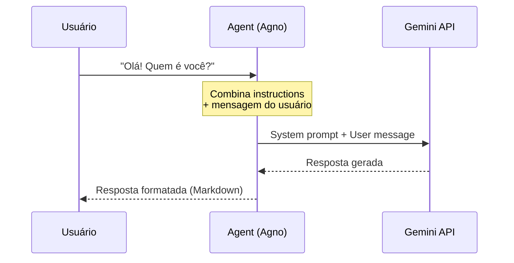

# Diagrama: Fluxo do Agente Conversacional



## Versão texto

```
┌─────────┐    mensagem    ┌─────────┐    API call    ┌─────────┐
│  Você   │ ─────────────> │  Agent  │ ─────────────> │ Gemini  │
│ (user)  │ <───────────── │ (Agno)  │ <───────────── │  (LLM)  │
└─────────┘    resposta    └─────────┘    response    └─────────┘
```
