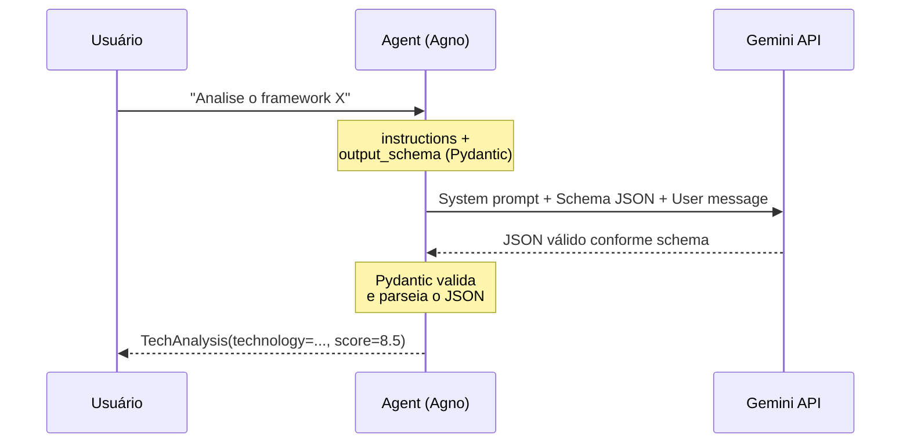

# Diagrama: Structured Output com Pydantic



## Versão texto

```
┌──────────┐     prompt      ┌─────────┐     API      ┌─────────┐
│   Você   │ ──────────────> │  Agent  │ ───────────> │ Gemini  │
│          │                 │         │              │         │
│          │  TechAnalysis   │  output │  JSON válido │         │
│          │ <────────────── │  schema │ <─────────── │         │
└──────────┘   (Pydantic)    └─────────┘              └─────────┘

instructions = ["Você é um analista...", "Responda em PT..."]
output_schema = TechAnalysis (BaseModel)
    ├── technology: str
    ├── summary: str
    ├── pros: list[str]
    ├── cons: list[str]
    └── score: float (0-10)
```
