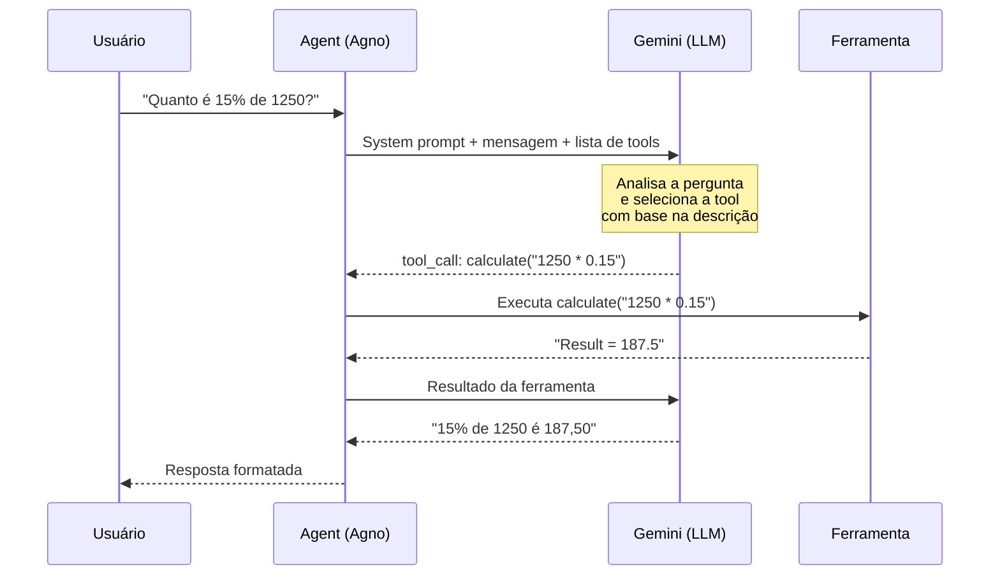
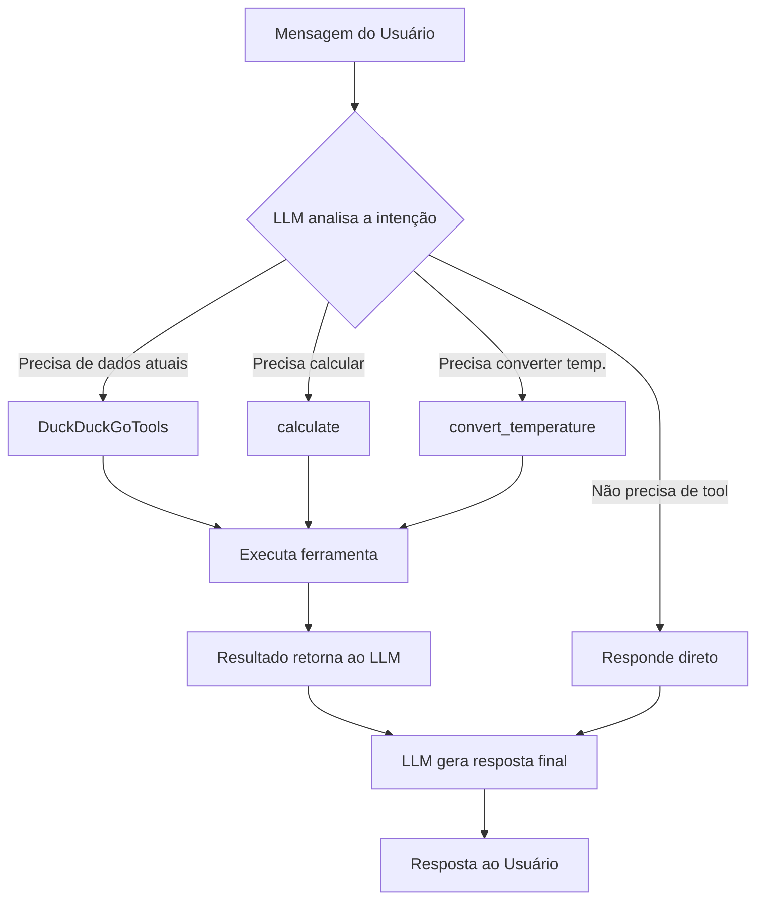

# Aula 03: Tool Calling

## Objetivo

Conectar um agente a ferramentas externas (busca web, calculadora, conversor) para que ele possa realizar ações no mundo real. Ao final, você entenderá como o LLM decide qual ferramenta usar e como criar suas próprias tools.

## Conceitos

- `tools` — lista de ferramentas disponíveis para o agente
- `@tool` — decorator do Agno para transformar uma função Python em ferramenta
- `DuckDuckGoTools` — toolkit built-in para busca na web
- `show_tool_calls=True` — exibe no terminal quais ferramentas o agente chamou
- **Function Calling** — protocolo que permite ao LLM invocar funções externas

## Pré-requisitos

- [Aula 01: Olá, Agente!](../aula-01-hello-agent/README.md) completada (conceito de Agent + Gemini)
- `.env` com GOOGLE_API_KEY configurada

## Teoria

### O que é Tool Calling (Function Calling)?

Até agora, nosso agente só gerava texto. Com **tool calling**, o LLM ganha "mãos" — ele pode executar funções para buscar informação, calcular valores, acessar APIs, etc.

O processo funciona assim:

1. Você envia uma mensagem ao agente junto com a **lista de ferramentas disponíveis**
2. O LLM analisa a mensagem e decide se precisa de alguma ferramenta
3. Se sim, retorna um **tool call** (nome da função + argumentos)
4. O Agno executa a função e envia o resultado de volta ao LLM
5. O LLM gera a resposta final incorporando o resultado



### Como o LLM escolhe a ferramenta?

O LLM **não executa código** — ele apenas decide qual ferramenta chamar com quais argumentos. A escolha é feita com base em:

1. **Nome da função** — nomes descritivos ajudam (ex: `calculate`, `convert_temperature`)
2. **Docstring** — a descrição da função é enviada ao LLM como contexto
3. **Parâmetros tipados** — tipos e descrições dos argumentos guiam o LLM
4. **Contexto da conversa** — o LLM usa a mensagem do usuário para inferir a intenção

Por isso, **boas descrições são essenciais**. Compare:

```python
# Ruim — LLM não sabe quando usar
@tool
def f(x: str) -> str:
    """Process input."""
    ...

# Bom — LLM entende exatamente quando usar
@tool
def calculate(expression: str) -> str:
    """Evaluate a math expression and return the result. Example: '2 + 3 * 4'"""
    ...
```

### Fluxo de decisão



### Criando tools com @tool

O decorator `@tool` do Agno transforma qualquer função Python em uma ferramenta utilizável pelo agente:

```python
from agno.tools import tool

@tool
def calculate(expression: str) -> str:
    """Evaluate a math expression and return the result."""
    result = eval(expression, {"__builtins__": {}}, {})
    return f"Result: {result}"
```

**Regras importantes:**

- A função **deve** ter uma docstring — é usada como descrição para o LLM
- Parâmetros devem ter **type hints** — o Agno gera o schema JSON automaticamente
- O retorno deve ser **string** — o resultado é enviado de volta ao LLM como texto
- Use nomes **descritivos** — o LLM usa o nome para decidir qual tool chamar

### Toolkits built-in

O Agno vem com dezenas de toolkits prontos:

| Toolkit | Descrição |
|---------|-----------|
| `DuckDuckGoTools` | Busca na web |
| `YFinanceTools` | Dados financeiros |
| `PythonTools` | Execução de código Python |
| `FileTools` | Leitura/escrita de arquivos |
| `ShellTools` | Comandos do sistema |

Nesta aula usamos `DuckDuckGoTools` junto com nossas tools customizadas.

> Diagrama completo disponível em [assets/diagram.md](assets/diagram.md).

## Prática

### Passo 1: Setup

```bash
cd aulas/aula-03-tool-calling
uv sync
```

### Passo 2: Código

Abra `tools.py` e analise as duas ferramentas:

**Calculadora** — avalia expressões matemáticas com segurança:
```python
@tool
def calculate(expression: str) -> str:
    """Evaluate a math expression and return the result."""
    allowed_names = {"abs": abs, "round": round, "min": min, ...}
    result = eval(expression, {"__builtins__": {}}, allowed_names)
    return f"Result of '{expression}' = {result}"
```

Note o uso de `{"__builtins__": {}}` para bloquear funções perigosas no `eval`.

**Conversor de temperatura** — converte entre Celsius, Fahrenheit e Kelvin:
```python
@tool
def convert_temperature(value: float, from_unit: str, to_unit: str) -> str:
    """Convert temperature between Celsius (C), Fahrenheit (F), and Kelvin (K)."""
    # Converte para Celsius como passo intermediário, depois para a unidade destino
```

Abra `main.py` — o agente é configurado com 3 tipos de ferramentas:

```python
agent = Agent(
    model=Gemini(id="gemini-2.5-flash"),
    tools=[DuckDuckGoTools(), calculate, convert_temperature],
    show_tool_calls=True,   # Mostra quais tools foram chamadas
    markdown=True,
)
```

O script faz 3 interações demonstrando cada ferramenta:
1. **Busca web** — perguntas sobre fatos atuais
2. **Calculadora** — expressões matemáticas
3. **Conversor** — conversão de temperatura

### Passo 3: Executar

```bash
uv run python main.py
```

Resultado esperado (observe os tool calls no output):

```
============================================================
INTERAÇÃO 1: Busca na Web
============================================================
┃ Tool call: duckduckgo_search(query="novidades IA 2025")
┃ As últimas novidades incluem...

============================================================
INTERAÇÃO 2: Calculadora
============================================================
┃ Tool call: calculate(expression="1250 * 0.15")
┃ Tool call: calculate(expression="144 ** 0.5")
┃ 15% de 1250 é 187,50 e a raiz quadrada de 144 é 12.

============================================================
INTERAÇÃO 3: Conversor de Temperatura
============================================================
┃ Tool call: convert_temperature(value=98.6, from_unit="F", to_unit="C")
┃ Tool call: convert_temperature(value=98.6, from_unit="F", to_unit="K")
┃ 98.6°F equivale a 37.00°C e 310.15K.
```

## Desafio

1. Crie uma classe `Toolkit` customizada com pelo menos 3 ferramentas relacionadas (ex: `StringTools` com funções para contar palavras, inverter texto, e converter para maiúsculas)
2. Adicione a tool ao agente e teste com perguntas que exijam combinar múltiplas ferramentas em uma única resposta
3. Experimente remover a docstring de uma tool e observe como o LLM perde a capacidade de usá-la corretamente

## Troubleshooting

| Erro | Solução |
|------|---------|
| `ImportError: ddgs` | Execute `uv sync` — ddgs é dependência do DuckDuckGoTools |
| Tool nunca é chamada | Verifique se a docstring descreve bem quando usar a tool |
| `eval()` retorna erro | A expressão é inválida — teste no Python REPL primeiro |
| `RateLimitError` do DuckDuckGo | Busca gratuita tem limites — aguarde alguns segundos |
| `show_tool_calls` não mostra nada | O LLM decidiu responder sem usar tools — reformule a pergunta |
| `TypeError` nos argumentos da tool | Verifique os type hints — o Agno usa para gerar o schema |

## Próxima Aula

[Aula 04: Agente ReAct](../aula-04-react-agent/README.md) — Adicione raciocínio explícito ao agente com o padrão Think-Act-Observe.
