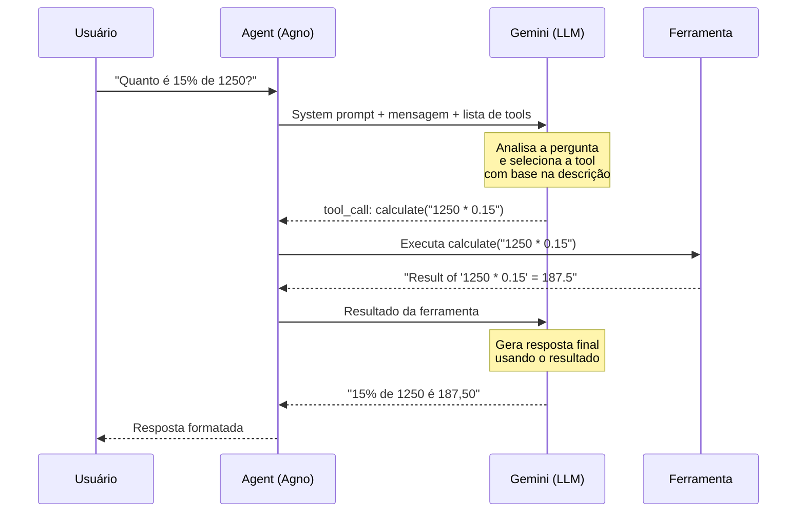
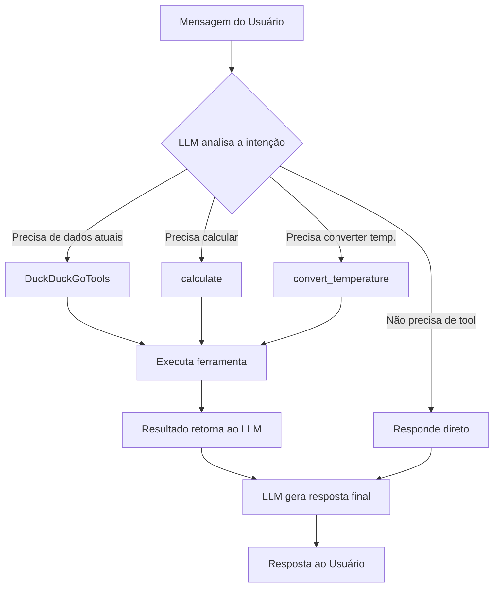

# Diagrama: Fluxo de Tool Calling



## Como o LLM seleciona a ferramenta



## Versão texto

```
┌──────────┐   mensagem   ┌─────────┐   msg + tools   ┌─────────┐
│ Usuário  │ ───────────> │  Agent  │ ──────────────> │ Gemini  │
│          │              │ (Agno)  │                 │  (LLM)  │
│          │              │         │  tool_call:     │         │
│          │              │         │ <────────────── │         │
│          │              │         │                 │         │
│          │              │  ┌──────────────┐         │         │
│          │              │  │  Ferramenta  │         │         │
│          │              │  │ (calculate)  │         │         │
│          │              │  └──────────────┘         │         │
│          │              │         │                 │         │
│          │              │         │  resultado      │         │
│          │              │         │ ──────────────> │         │
│          │   resposta   │         │  resposta final │         │
│          │ <─────────── │         │ <────────────── │         │
└──────────┘              └─────────┘                 └─────────┘
```
