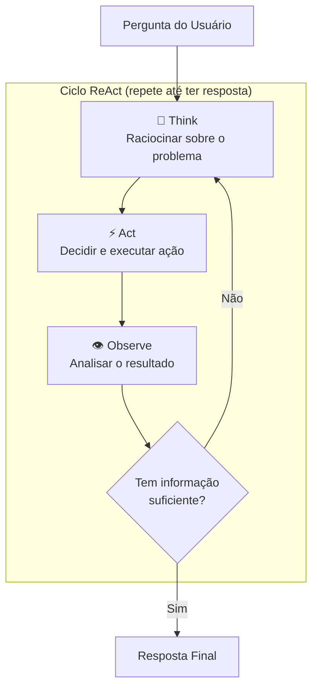
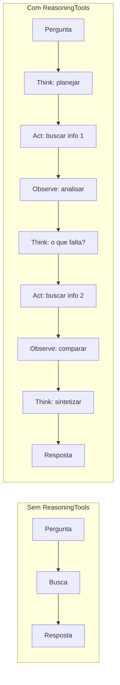

# Aula 04: Agente ReAct

## Objetivo

Adicionar raciocínio explícito ao agente usando o padrão ReAct (Reasoning + Acting). Ao final, você entenderá como o ciclo Think-Act-Observe melhora a qualidade das respostas e como visualizar o processo de raciocínio do agente.

## Conceitos

- **ReAct** — padrão que combina raciocínio (Reasoning) com ações (Acting) em um loop iterativo
- `ReasoningTools` — ferramentas do Agno que dão ao LLM a capacidade de "pensar em voz alta"
- `show_full_reasoning=True` — exibe o processo de raciocínio completo no terminal
- `add_instructions=True` — adiciona instruções automáticas sobre como usar as reasoning tools
- **Think → Act → Observe** — o ciclo fundamental do ReAct

## Pré-requisitos

- [Aula 03](../aula-03-tool-calling/) completada
- `.env` com GOOGLE_API_KEY configurada

## Teoria

### O Problema: LLMs Agem sem Pensar

Quando um agente recebe uma pergunta complexa com ferramentas disponíveis, ele tende a:

- Chamar a primeira ferramenta que parece relevante
- Não planejar a sequência de ações
- Não refletir sobre resultados intermediários
- Gerar respostas superficiais

### A Solução: ReAct (Yao et al., 2022)

O paper [ReAct: Synergizing Reasoning and Acting in Language Models](https://arxiv.org/abs/2210.03629) propôs uma abordagem simples e poderosa: intercalar **pensamento** com **ação**.

Em vez de ir direto da pergunta para a ação, o agente segue um ciclo:



### As 3 Fases do Ciclo

| Fase | O que acontece | Exemplo |
|------|---------------|---------|
| **Think** | O LLM raciocina sobre o que sabe e o que falta | "Preciso comparar Agno e LangGraph. Vou buscar dados sobre cada um." |
| **Act** | O LLM escolhe e executa uma ferramenta | `duckduckgo_search("Agno framework AI agents 2025")` |
| **Observe** | O LLM analisa o resultado da ação | "Encontrei que Agno é 529x mais rápido. Agora preciso buscar LangGraph." |

O ciclo se repete até que o agente tenha informação suficiente para gerar a resposta final.

### Por que ReAct melhora os resultados?

1. **Planejamento** — o agente pensa antes de agir, evitando buscas desnecessárias
2. **Decomposição** — problemas complexos são quebrados em passos menores
3. **Verificação** — o agente avalia resultados intermediários antes de prosseguir
4. **Transparência** — você pode ver exatamente como o agente chegou à resposta
5. **Autocorreção** — se uma ação falha, o agente pode repensar a estratégia

### ReasoningTools no Agno

O Agno implementa o padrão ReAct através de `ReasoningTools`, que adiciona ferramentas de raciocínio ao agente:

```python
from agno.tools.reasoning import ReasoningTools

agent = Agent(
    tools=[
        ReasoningTools(add_instructions=True),  # Adiciona capacidade de pensar
        DuckDuckGoTools(),                       # Ferramentas de ação
    ],
)
```

Com `add_instructions=True`, o Agno injeta automaticamente instruções que ensinam o LLM a usar o ciclo Think-Act-Observe.

### Comparação visual



O agente com ReasoningTools faz mais passos, mas a resposta final tende a ser mais completa, precisa e bem fundamentada.

> Diagrama completo disponível em [assets/diagram.md](assets/diagram.md).

## Prática

### Passo 1: Setup

```bash
cd aulas/aula-04-react-agent
uv sync
```

### Passo 2: Código

Abra `main.py`. Temos dois agentes para comparação:

**Agente básico** (sem raciocínio):
```python
basic_agent = Agent(
    model=Gemini(id="gemini-2.5-flash"),
    tools=[DuckDuckGoTools()],
    instructions=["Você é um assistente de pesquisa.", ...],
)
```

**Agente ReAct** (com raciocínio):
```python
react_agent = Agent(
    model=Gemini(id="gemini-2.5-flash"),
    tools=[
        ReasoningTools(add_instructions=True),
        DuckDuckGoTools(),
    ],
    instructions=["Você é um assistente de pesquisa que raciocina passo a passo.", ...],
)
```

A diferença é **uma linha**: `ReasoningTools(add_instructions=True)`. O restante do código é idêntico.

Ambos recebem a mesma pergunta complexa:

> "Compare os frameworks Agno e LangGraph para desenvolvimento de agentes de IA. Quais são as vantagens e desvantagens de cada um? Qual seria mais indicado para um projeto de produção em 2025?"

### Passo 3: Executar

```bash
uv run python main.py
```

Resultado esperado — observe a diferença:

**Sem ReasoningTools:**
```
============================================================
SEM ReasoningTools (resposta direta)
============================================================
┃ Tool call: duckduckgo_search(...)
┃ [resposta direta, possivelmente superficial]
```

**Com ReasoningTools:**
```
============================================================
COM ReasoningTools (Think → Act → Observe)
============================================================
┃ Tool call: think("Preciso comparar dois frameworks...")
┃ Tool call: duckduckgo_search("Agno framework AI agents")
┃ Tool call: think("Encontrei informações sobre Agno, agora preciso...")
┃ Tool call: duckduckgo_search("LangGraph framework AI agents")
┃ Tool call: think("Tenho dados suficientes para comparar...")
┃ [resposta mais completa e estruturada]
```

### O que observar

1. **Número de tool calls** — o agente ReAct geralmente faz mais chamadas, mas mais direcionadas
2. **Qualidade da resposta** — compare profundidade, estrutura e precisão
3. **Raciocínio visível** — com `show_full_reasoning=True`, você vê cada etapa de pensamento
4. **Autocorreção** — o agente pode mudar de estratégia durante o ciclo

## Desafio

1. Compare as respostas dos dois agentes para perguntas de complexidade diferentes:
   - Simples: "Qual é a capital da França?"
   - Média: "Quais são os 3 melhores frameworks Python para web em 2025?"
   - Complexa: a pergunta do exemplo
2. Em qual nível de complexidade o ReAct faz mais diferença?
3. Adicione uma ferramenta customizada (da Aula 03) ao agente ReAct e observe como ele combina raciocínio com a ferramenta
4. Teste com `add_few_shot=True` em `ReasoningTools` e compare a qualidade do raciocínio

## Troubleshooting

| Erro | Solução |
|------|---------|
| `ImportError: ReasoningTools` | Execute `uv sync` — verifique que `agno` está atualizado |
| Raciocínio não aparece | Certifique-se de usar `show_full_reasoning=True` no `print_response` |
| Agente entra em loop infinito | O LLM pode ficar pensando demais — simplifique a pergunta |
| `RateLimitError` | Dois agentes = dobro de chamadas — aguarde entre execuções |
| Respostas idênticas com e sem reasoning | Para perguntas simples, o raciocínio não faz diferença — teste com perguntas complexas |
| `show_tool_calls` não mostra reasoning | `show_tool_calls` mostra tools externas; use `show_full_reasoning` para ver o raciocínio |

## Próxima Aula

[Aula 05: Memory](../aula-05-memory/) — Dê memória ao agente para que ele lembre de conversas anteriores.
