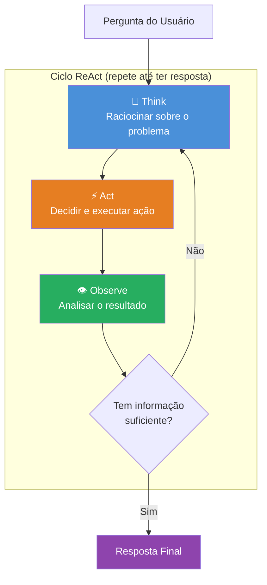
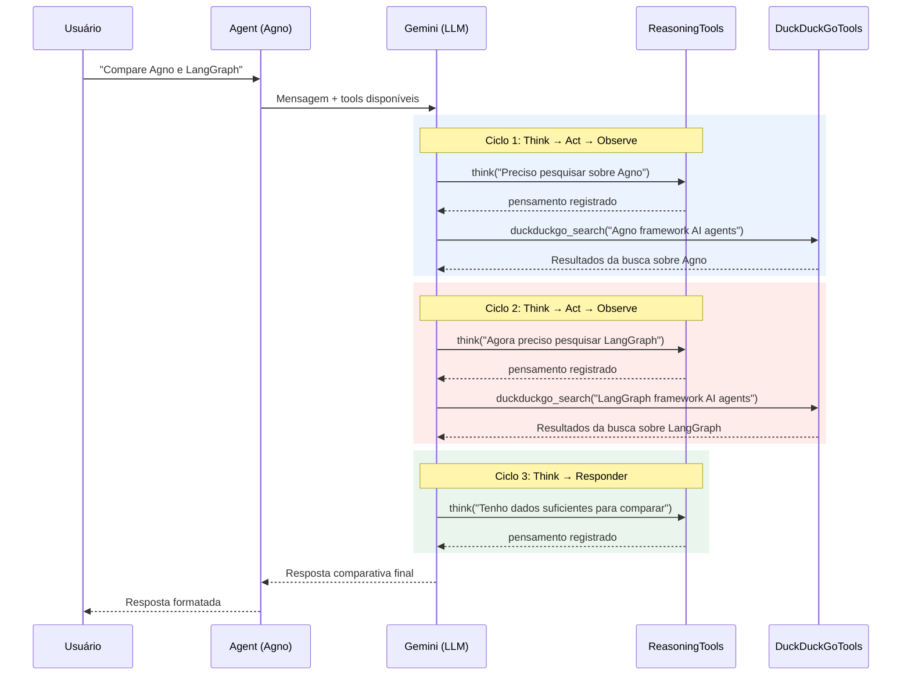
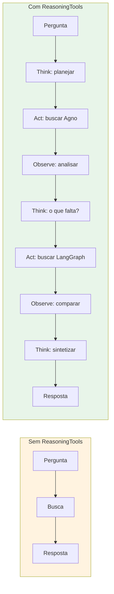

# Diagrama: Ciclo ReAct (Reasoning + Acting)



## Ciclo detalhado com ferramentas



## Comparação: com e sem ReAct



## Versão texto

```
┌─────────────────────────────────────────────────────────┐
│                    CICLO ReAct                          │
│                                                         │
│  ┌──────────┐    ┌──────────┐    ┌──────────┐          │
│  │  THINK   │───>│   ACT    │───>│ OBSERVE  │          │
│  │ Raciocin │    │ Executar │    │ Analisar │          │
│  │ ar sobre │    │ ação /   │    │ resulta- │          │
│  │ problema │    │ tool     │    │ do       │          │
│  └──────────┘    └──────────┘    └────┬─────┘          │
│       ▲                               │                 │
│       │          Informação           │                 │
│       │          insuficiente         │                 │
│       └───────────────────────────────┘                 │
│                       │                                 │
│                Informação suficiente                    │
│                       ▼                                 │
│              ┌──────────────┐                           │
│              │   RESPOSTA   │                           │
│              │    FINAL     │                           │
│              └──────────────┘                           │
└─────────────────────────────────────────────────────────┘
```
