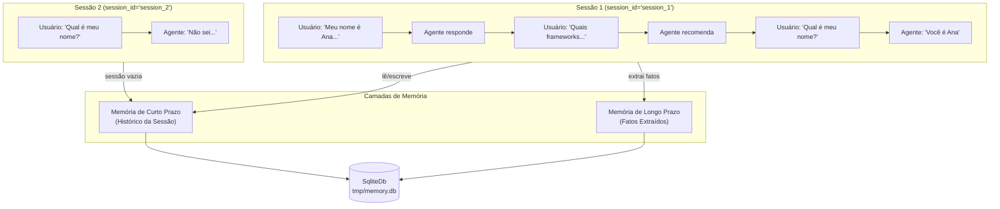

# Aula 05: Memory — Agente com Memória Persistente

## Objetivo

Entender como agentes mantêm contexto entre interações usando memória de curto prazo (histórico da sessão) e memória de longo prazo (extração de fatos). Ao final, você terá um agente que lembra do que foi dito dentro de uma sessão e demonstra isolamento entre sessões diferentes.

## Conceitos

- `db` — backend de armazenamento persistente (SqliteDb, PostgresDb)
- `add_history_to_context` — injeta mensagens anteriores da sessão no contexto do agente
- `num_history_runs` — quantas interações anteriores incluir no contexto
- `update_memory_on_run` — extrai fatos relevantes automaticamente após cada interação
- `session_id` — identificador que isola o histórico entre conversas diferentes

## Pré-requisitos

- [Aula 01: Olá, Agente!](../aula-01-hello-agent/README.md) completada (conceito de Agent + Gemini)
- `.env` com GOOGLE_API_KEY configurada

## Teoria

### Por que memória importa?

Sem memória, cada chamada ao agente é independente — ele não sabe o que foi dito antes. Isso é como conversar com alguém que esquece tudo entre frases. Memória permite:

- **Continuidade** — o agente lembra seu nome, preferências e contexto
- **Personalização** — respostas se adaptam ao que o agente aprendeu sobre você
- **Conversas naturais** — referências a turnos anteriores funcionam ("como eu disse antes...")

### Memória de Curto Prazo (Session History)

O histórico da sessão é a sequência de mensagens trocadas dentro de uma conversa. Quando `add_history_to_context=True`, o Agno injeta as últimas `num_history_runs` interações no prompt enviado ao LLM:

```
[System] Você é um assistente com boa memória...
[History] Usuário: Meu nome é Ana...
[History] Agente: Olá Ana! Como posso ajudar?
[History] Usuário: Quais frameworks de ML?
[History] Agente: Para ML recomendo PyTorch, scikit-learn...
[Current] Usuário: Qual é meu nome?
→ O agente vê TODO o contexto e responde: "Seu nome é Ana"
```

Cada `session_id` tem seu próprio histórico. Uma nova sessão começa vazia.

### Memória de Longo Prazo (Memory Extraction)

Com `update_memory_on_run=True`, o Agno analisa cada interação e extrai fatos relevantes sobre o usuário (nome, profissão, preferências). Esses fatos são armazenados separadamente e podem persistir entre sessões.

### SqliteDb como Storage

O Agno usa `SqliteDb` para persistir sessões e memórias em um arquivo local. Não precisa de servidor — basta apontar para um arquivo `.db`:

```python
db = SqliteDb(db_file="tmp/memory.db")
```

### Diagrama



> Diagrama completo disponível em [assets/diagram.md](assets/diagram.md).

## Prática

### Passo 1: Setup

```bash
cd aulas/aula-05-memory
uv sync
```

### Passo 2: Código

O `main.py` demonstra duas sessões:

**Sessão 1 — Construindo contexto (3 interações):**
```python
agent.print_response("Meu nome é Ana e eu trabalho com machine learning.",
                     session_id="session_1", stream=True)
agent.print_response("Quais frameworks de ML você recomenda para mim?",
                     session_id="session_1", stream=True)
agent.print_response("Qual é meu nome e o que eu faço?",
                     session_id="session_1", stream=True)
```

Na terceira interação, o agente acessa o histórico da sessão e responde corretamente com o nome e profissão.

**Sessão 2 — Nova sessão (isolamento):**
```python
agent.print_response("Qual é meu nome?",
                     session_id="session_2", stream=True)
```

Como o `session_id` é diferente, o agente não tem histórico e não sabe responder.

### Passo 3: Executar

```bash
uv run python main.py
```

Resultado esperado:

```
=== Sessão 1: Construindo contexto ===

┃ Olá Ana! Prazer em conhecê-la! Machine learning é uma área fascinante...

┃ Para alguém que trabalha com ML como você, Ana, recomendo:
┃ - PyTorch — flexível para pesquisa
┃ - scikit-learn — ideal para ML clássico
┃ - TensorFlow/Keras — produção em escala

┃ Seu nome é Ana e você trabalha com machine learning!

=== Sessão 2: Nova sessão (sem contexto) ===

┃ Desculpe, não tenho essa informação. Poderia me dizer seu nome?
```

## Desafio

1. Adicione `enable_agentic_memory=True` ao agente e use um `user_id` nas chamadas
2. Após a sessão 1, use `agent.get_user_memories(user_id=...)` para ver os fatos extraídos
3. Teste se uma nova sessão com o mesmo `user_id` consegue acessar os fatos de longo prazo mesmo sem histórico de sessão

```python
from agno.memory import MemoryManager

memory_manager = MemoryManager(
    model=Gemini(id="gemini-2.5-flash"),
    db=db,
)

agent = Agent(
    model=Gemini(id="gemini-2.5-flash"),
    db=db,
    memory_manager=memory_manager,
    enable_agentic_memory=True,
    add_history_to_context=True,
    num_history_runs=5,
    markdown=True,
)
```

## Troubleshooting

| Erro | Solução |
|------|---------|
| `ModuleNotFoundError: sqlalchemy` | Execute `uv sync` — sqlalchemy é dependência do SqliteDb |
| Agente não lembra de nada | Verifique se `add_history_to_context=True` e o `session_id` é o mesmo |
| Sessão 2 lembra da sessão 1 | Confirme que os `session_id` são diferentes |
| Arquivo `tmp/memory.db` não criado | O diretório `tmp/` é criado automaticamente pelo Agno |
| `update_memory_on_run` não extrai fatos | Funciona melhor com interações que contêm informações pessoais claras |

## Próxima Aula

[Aula 06: Knowledge + RAG](../aula-06-knowledge-rag/README.md) — Conecte seu agente a uma base de conhecimento com vector database para responder perguntas sobre documentos.
