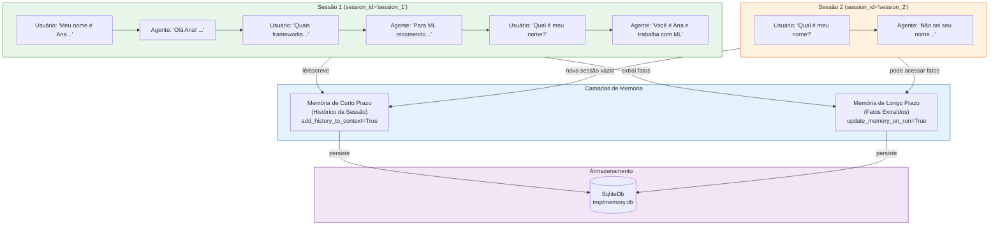

# Diagrama: Sistema de Memória do Agente

```mermaid
flowchart TB
    subgraph Session1["Sessão 1 (session_id='session_1')"]
        U1["Usuário: 'Meu nome é Ana...'"]
        A1["Agente: 'Olá Ana! ...'"]
        U2["Usuário: 'Quais frameworks...'"]
        A2["Agente: 'Para ML recomendo...'"]
        U3["Usuário: 'Qual é meu nome?'"]
        A3["Agente: 'Você é Ana e trabalha com ML'"]
        U1 --> A1 --> U2 --> A2 --> U3 --> A3
    end

    subgraph Session2["Sessão 2 (session_id='session_2')"]
        U4["Usuário: 'Qual é meu nome?'"]
        A4["Agente: 'Não sei seu nome...'"]
        U4 --> A4
    end

    subgraph Memory["Camadas de Memória"]
        direction TB
        ShortTerm["Memória de Curto Prazo\n(Histórico da Sessão)\nadd_history_to_context=True"]
        LongTerm["Memória de Longo Prazo\n(Fatos Extraídos)\nupdate_memory_on_run=True"]
    end

    subgraph Storage["Armazenamento"]
        DB[("SqliteDb\ntmp/memory.db")]
    end

    Session1 -->|"lê/escreve"| ShortTerm
    Session1 -->|"extrai fatos"| LongTerm
    Session2 -->|"nova sessão vazia"| ShortTerm
    Session2 -->|"pode acessar fatos"| LongTerm
    ShortTerm -->|"persiste"| DB
    LongTerm -->|"persiste"| DB

    style Session1 fill:#e8f5e9,stroke:#2e7d32
    style Session2 fill:#fff3e0,stroke:#e65100
    style Memory fill:#e3f2fd,stroke:#1565c0
    style Storage fill:#f3e5f5,stroke:#6a1b9a
```
