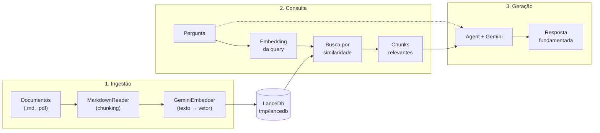

# Aula 06: Knowledge + RAG — Agente que Consulta Base de Conhecimento

## Objetivo

Aprender a construir um agente que consulta documentos próprios usando Retrieval Augmented Generation (RAG). Ao final, você terá um agente que carrega arquivos Markdown em um vector database e responde perguntas com base no conteúdo desses documentos.

## Conceitos

- **Embeddings** — representações vetoriais de texto que capturam significado semântico
- **Vector Database** — banco de dados otimizado para busca por similaridade vetorial (LanceDb)
- **RAG** — padrão que recupera documentos relevantes e os injeta no contexto do LLM
- **Chunking** — divisão de documentos grandes em pedaços menores para indexação
- `Knowledge` — classe do Agno que gerencia a base de conhecimento
- `GeminiEmbedder` — gera embeddings usando modelos Google
- `search_knowledge` — habilita busca automática na base de conhecimento

## Pré-requisitos

- [Aula 01: Olá, Agente!](../aula-01-hello-agent/) completada (conceito de Agent + Gemini)
- `.env` com GOOGLE_API_KEY configurada

## Teoria

### O Problema

LLMs são treinados com dados até uma data de corte e não conhecem seus documentos internos. Quando você pergunta algo específico do seu domínio, o LLM inventa (alucina) ou diz que não sabe.

**RAG resolve isso**: antes de gerar a resposta, o sistema busca trechos relevantes nos seus documentos e os inclui no prompt.

### Como Embeddings Funcionam

Um embedding converte texto em um vetor numérico de alta dimensão. Textos com significado similar produzem vetores próximos no espaço vetorial:

```
"Python é uma linguagem de programação"  →  [0.12, -0.34, 0.56, ...]
"Java é uma linguagem de programação"    →  [0.11, -0.33, 0.55, ...]  ← próximo!
"Receita de bolo de chocolate"           →  [0.87, 0.23, -0.91, ...]  ← distante
```

### Pipeline RAG

O RAG tem duas fases:

**Fase 1 — Ingestão (offline):**
1. Documentos são lidos e divididos em chunks
2. Cada chunk é convertido em embedding pelo GeminiEmbedder
3. Vetores e texto são armazenados no LanceDb

**Fase 2 — Consulta (runtime):**
1. A pergunta do usuário é convertida em embedding
2. Busca por similaridade encontra os chunks mais relevantes
3. Os chunks são injetados no prompt do agente
4. O LLM gera a resposta usando o contexto recuperado

### Diagrama



> Diagrama completo disponível em [assets/diagram.md](assets/diagram.md).

### Vector Database (LanceDb)

LanceDb é um vector database embarcado — roda localmente sem servidor, assim como SQLite. Ideal para prototipagem e aplicações de menor escala:

```python
LanceDb(
    table_name="course_docs",   # nome da tabela
    uri="tmp/lancedb",          # diretório local
    search_type=SearchType.vector,  # busca vetorial
    embedder=GeminiEmbedder(),  # modelo de embedding
)
```

## Prática

### Passo 1: Setup

```bash
cd aulas/aula-06-knowledge-rag
uv sync
```

### Passo 2: Documentos

O diretório `docs/` contém dois arquivos de exemplo:

- `docs/python-guide.md` — guia de boas práticas Python
- `docs/agno-overview.md` — visão geral do framework Agno

Esses arquivos servem como base de conhecimento do agente.

### Passo 3: Código

O `main.py` tem duas fases:

**Ingestão — carregando documentos:**
```python
knowledge = Knowledge(
    vector_db=LanceDb(
        table_name="course_docs",
        uri="tmp/lancedb",
        search_type=SearchType.vector,
        embedder=GeminiEmbedder(),
    ),
)

knowledge.insert(path="docs/python-guide.md", reader=MarkdownReader())
knowledge.insert(path="docs/agno-overview.md", reader=MarkdownReader())
```

**Consulta — fazendo perguntas:**
```python
agent = Agent(
    model=Gemini(id="gemini-2.5-flash"),
    knowledge=knowledge,
    search_knowledge=True,  # busca automática na base
)

agent.print_response("Quais são as melhores práticas de Python?", stream=True)
```

### Passo 4: Executar

```bash
uv run python main.py
```

Resultado esperado:

```
=== Pergunta 1: Boas práticas Python ===

┃ Com base na documentação, as melhores práticas incluem:
┃ - Use type hints em todas as funções
┃ - Prefira f-strings para formatação
┃ - Siga PEP 8 para nomenclatura
┃ - Escreva testes unitários com pytest
┃ ...

=== Pergunta 2: Framework Agno ===

┃ O Agno é um framework Python para construir agentes de IA.
┃ Seus principais recursos incluem:
┃ - Tool Calling, Structured Output, Memory
┃ - Knowledge + RAG com vector databases
┃ - Multi-Agent Teams
┃ ...
```

Note que as respostas são fundamentadas no conteúdo dos documentos, não em conhecimento geral do LLM.

## Desafio

1. Crie um terceiro documento (`docs/ml-guide.md`) sobre conceitos de Machine Learning
2. Adicione-o à base de conhecimento com `knowledge.insert(path="docs/ml-guide.md", reader=MarkdownReader())`
3. Teste perguntas que cruzam informações entre os documentos
4. **Bônus**: adicione um arquivo PDF usando o reader apropriado:

```python
from agno.knowledge.reader.pdf import PDFReader

knowledge.insert(path="docs/artigo.pdf", reader=PDFReader())
```

> Para PDFs, instale a dependência extra: `uv add pypdf`

## Troubleshooting

| Erro | Solução |
|------|---------|
| `ModuleNotFoundError: lancedb` | Execute `uv sync` — lancedb é dependência declarada |
| `GOOGLE_API_KEY` não encontrada | Verifique o `.env` — GeminiEmbedder precisa da mesma key |
| Respostas não usam os documentos | Confirme `search_knowledge=True` e que `knowledge.insert()` foi executado |
| Chunks muito grandes ou pequenos | Experimente configurar `chunk_size` no reader |
| `tantivy` import error | Execute `uv sync` — tantivy é dependência para busca híbrida |
| Respostas genéricas sem citar docs | O LLM pode ignorar contexto curto — adicione mais conteúdo aos documentos |

## Próxima Aula

[Aula 07: Planning](../aula-07-planning/) — Faça seu agente decompor problemas complexos em etapas antes de agir.
