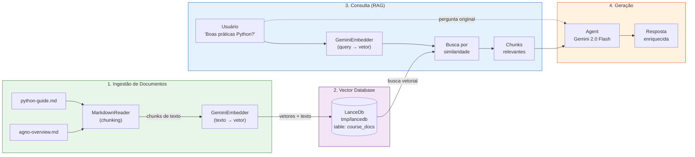

# Diagrama: Pipeline RAG (Retrieval Augmented Generation)

```mermaid
flowchart LR
    subgraph Ingestão["1. Ingestão de Documentos"]
        direction TB
        Doc1["python-guide.md"]
        Doc2["agno-overview.md"]
        Reader["MarkdownReader\n(chunking)"]
        Embedder["GeminiEmbedder\n(texto → vetor)"]
        Doc1 --> Reader
        Doc2 --> Reader
        Reader -->|"chunks de texto"| Embedder
    end

    subgraph VectorDB["2. Vector Database"]
        DB[("LanceDb\ntmp/lancedb\ntable: course_docs")]
    end

    subgraph Query["3. Consulta (RAG)"]
        direction TB
        User["Usuário\n'Boas práticas Python?'"]
        QueryEmb["GeminiEmbedder\n(query → vetor)"]
        Search["Busca por\nsimilaridade"]
        Chunks["Chunks\nrelevantes"]
        User --> QueryEmb --> Search --> Chunks
    end

    subgraph Generation["4. Geração"]
        Agent["Agent\nGemini 2.0 Flash"]
        Response["Resposta\nenriquecida"]
        Chunks --> Agent
        User -.->|"pergunta original"| Agent
        Agent --> Response
    end

    Embedder -->|"vetores + texto"| DB
    DB -->|"busca vetorial"| Search

    style Ingestão fill:#e8f5e9,stroke:#2e7d32
    style VectorDB fill:#f3e5f5,stroke:#6a1b9a
    style Query fill:#e3f2fd,stroke:#1565c0
    style Generation fill:#fff3e0,stroke:#e65100
```
