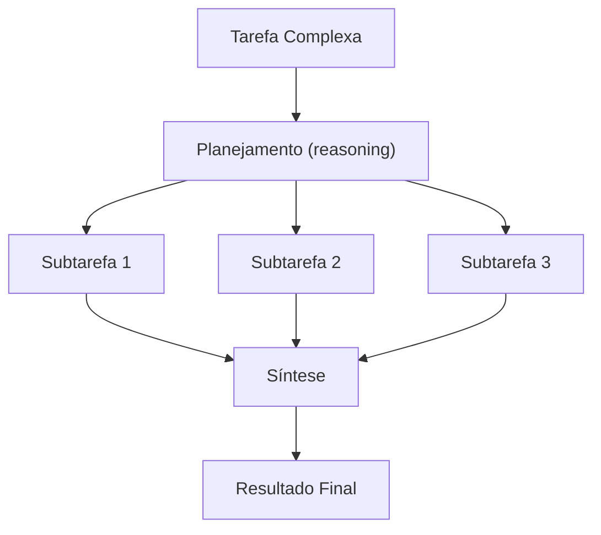

# Aula 07: Planejamento e Decomposição

## Objetivo

Entender como um agente de IA planeja e decompõe tarefas complexas em subtarefas menores. Ao final desta aula, você terá um agente que raciocina passo a passo, pesquisa na web e sintetiza informações de múltiplas fontes.

## Conceitos

- `reasoning=True` — ativa o raciocínio interno do agente (chain-of-thought)
- `show_full_reasoning=True` — exibe o processo de raciocínio completo ao usuário
- `DuckDuckGoTools` — ferramenta de busca web que o agente usa para obter dados atualizados
- **Task decomposition** — técnica de dividir uma tarefa complexa em subtarefas menores e gerenciáveis

## Pré-requisitos

- [Aula 03: Tool Calling](../aula-03-tool-calling/) completada
- [Aula 04: Agente ReAct](../aula-04-react-agent/) completada
- `.env` com GOOGLE_API_KEY configurada

## Teoria

### O Problema das Tarefas Complexas

Quando damos uma tarefa simples a um LLM ("traduza essa frase"), ele responde diretamente. Mas tarefas complexas exigem múltiplos passos, pesquisa e síntese. Sem planejamento, o agente pode:

- Pular etapas importantes
- Dar respostas superficiais
- Inventar dados em vez de pesquisar
- Perder o fio condutor da tarefa

### Task Decomposition (Decomposição de Tarefas)

Decomposição é a técnica de quebrar um problema grande em partes menores. É como um gerente de projeto que divide um projeto em tarefas individuais:

```
Tarefa: "Compare 3 frameworks de IA"
├── Subtarefa 1: Pesquisar Agno
├── Subtarefa 2: Pesquisar LangChain
├── Subtarefa 3: Pesquisar CrewAI
├── Subtarefa 4: Comparar os três
└── Subtarefa 5: Formular recomendação
```

Cada subtarefa é simples o suficiente para ser executada de forma confiável.

### Chain-of-Thought Reasoning

Chain-of-thought (CoT) é uma técnica onde o LLM "pensa em voz alta" antes de responder. Em vez de ir direto à resposta, ele:

1. **Analisa** o que está sendo pedido
2. **Planeja** os passos necessários
3. **Executa** cada passo em sequência
4. **Sintetiza** os resultados em uma resposta coerente

Estudos mostram que CoT melhora significativamente a precisão em tarefas que exigem raciocínio.

### Como `reasoning=True` Funciona no Agno

Quando você ativa `reasoning=True`, o Agno instrui o LLM a pensar antes de agir:

```
┌─────────────┐     tarefa complexa     ┌──────────────┐
│   Usuário   │ ──────────────────────> │    Agent      │
│             │                         │ reasoning=True│
│             │                         └──────┬───────┘
│             │                                │
│             │                         ┌──────▼───────┐
│             │                         │  Raciocínio  │
│             │                         │  1. Analisar │
│             │                         │  2. Planejar │
│             │                         │  3. Executar │
│             │                         │  4. Sintetizar│
│             │                         └──────┬───────┘
│             │                                │
│             │     resposta estruturada  ┌────▼─────┐
│             │ <─────────────────────── │ Resultado │
└─────────────┘                          └──────────┘
```

O parâmetro `show_full_reasoning=True` faz o agente exibir todo esse raciocínio interno, permitindo que você veja como ele pensou.

### Planejamento + Ferramentas

A combinação de raciocínio com ferramentas é poderosa. O agente pode:

1. **Planejar** quais pesquisas fazer
2. **Executar** buscas na web com DuckDuckGo
3. **Avaliar** os resultados e decidir se precisa de mais informação
4. **Sintetizar** tudo em uma resposta fundamentada

Isso é muito mais confiável do que um agente que simplesmente gera texto a partir do que "memorizou" durante o treinamento.



> Diagrama completo disponível em [assets/diagram.md](assets/diagram.md).

## Prática

### Passo 1: Setup

```bash
cd aulas/aula-07-planning
uv sync
```

### Passo 2: Código

Abra o arquivo `main.py` e analise:

```python
from dotenv import load_dotenv
from agno.agent import Agent
from agno.models.google import Gemini
from agno.tools.duckduckgo import DuckDuckGoTools

load_dotenv()

planner = Agent(
    model=Gemini(id="gemini-2.5-flash"),
    reasoning=True,                      # Ativa chain-of-thought
    tools=[DuckDuckGoTools()],           # Ferramenta de busca
    instructions=[
        "Você é um analista que decompõe tarefas complexas em subtarefas.",
        "Sempre planeje antes de agir.",
        "Pesquise na web para obter dados atualizados.",
        "Apresente resultados estruturados em português.",
    ],
    show_full_reasoning=True,            # Mostra o raciocínio
    markdown=True,
)
```

**Pontos-chave:**

1. `reasoning=True` — o agente pensa antes de agir, decompondo a tarefa
2. `show_full_reasoning=True` — exibe o processo de raciocínio no terminal
3. `DuckDuckGoTools()` — permite buscar informações atualizadas na web
4. As `instructions` reforçam o comportamento de planejar e estruturar

### Passo 3: Executar

```bash
uv run python main.py
```

Resultado esperado (resumido):

```
=== Tarefa Complexa com Planejamento ===

[Reasoning]
Vou decompor esta tarefa em subtarefas:
1. Pesquisar informações sobre o Agno
2. Pesquisar informações sobre o LangChain
3. Pesquisar informações sobre o CrewAI
4. Comparar os três em facilidade, performance e comunidade
5. Formular uma recomendação

[Executing searches...]

┃ ## Comparação de Frameworks para Agentes de IA
┃
┃ ### Agno
┃ - **Facilidade**: API simples e intuitiva...
┃ - **Performance**: 529x mais rápido que LangGraph...
┃ - **Comunidade**: Crescente, GitHub ativo...
┃
┃ ### LangChain
┃ - **Facilidade**: Curva de aprendizado moderada...
┃ ...
┃
┃ ### Recomendação
┃ Para iniciantes, recomendo o Agno pela...
```

Observe como o agente primeiro planeja, depois pesquisa cada framework, e finalmente sintetiza tudo.

Com `show_full_reasoning=True`, você verá o "pensamento" do agente antes da resposta. Isso é valioso para:

- **Debug** — entender por que o agente tomou certas decisões
- **Confiança** — verificar se o raciocínio faz sentido
- **Aprendizado** — ver como um bom planejamento funciona

## Desafio

1. **Tarefa com 5+ subtarefas**: Peça ao agente para "Criar um plano de estudo de 4 semanas para aprender desenvolvimento de agentes de IA, incluindo recursos gratuitos, projetos práticos, e métricas de progresso"
2. **Compare com e sem reasoning**: Execute a mesma tarefa com `reasoning=True` e `reasoning=False`. Observe a diferença na qualidade
3. **Adicione structured output**: Crie um schema Pydantic para o resultado da comparação (nome, facilidade_score, performance_score, comunidade_score, recomendado: bool)

## Troubleshooting

| Erro | Solução |
|------|---------|
| `ModuleNotFoundError: No module named 'duckduckgo_search'` | Execute `uv sync` — o pacote `ddgs` é necessário |
| Reasoning não aparece | Verifique que `show_full_reasoning=True` está definido |
| Busca web retorna vazio | DuckDuckGo pode ter rate limit — aguarde e tente novamente |
| Resposta muito longa/curta | Ajuste as instructions com limites de tamanho |
| `TimeoutError` na busca | Conexão lenta — tente novamente ou reduza o número de buscas |

## Próxima Aula

[Aula 08: Multi-Agent Team](../aula-08-multi-agent-team/) — Aprenda a criar equipes de agentes especializados que colaboram para resolver problemas complexos.
