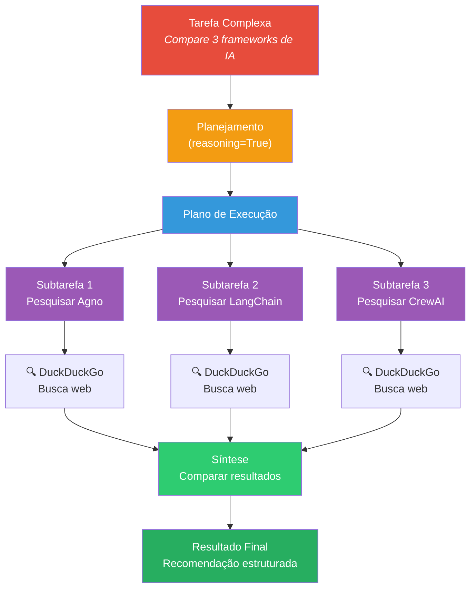
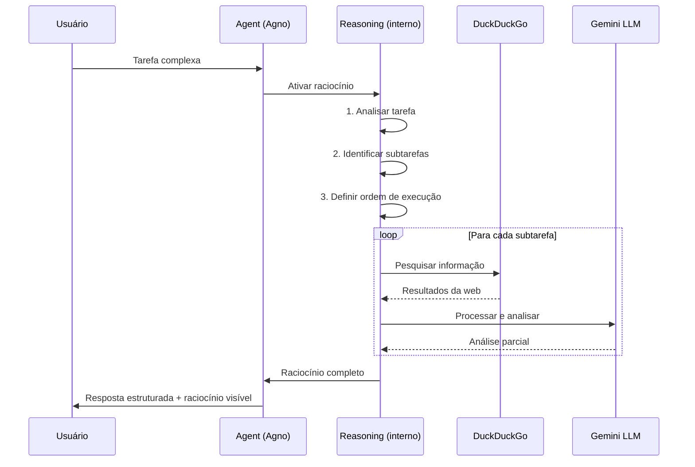

# Diagrama: Planejamento e Decomposição de Tarefas

## Fluxo de Planejamento

```mermaid
flowchart TD
    A["Tarefa Complexa<br/><i>Compare 3 frameworks de IA</i>"] --> B["Planejamento<br/>(reasoning=True)"]

    B --> C["Plano de Execução"]

    C --> D1["Subtarefa 1<br/>Pesquisar Agno"]
    C --> D2["Subtarefa 2<br/>Pesquisar LangChain"]
    C --> D3["Subtarefa 3<br/>Pesquisar CrewAI"]

    D1 --> E1["🔍 DuckDuckGo<br/>Busca web"]
    D2 --> E2["🔍 DuckDuckGo<br/>Busca web"]
    D3 --> E3["🔍 DuckDuckGo<br/>Busca web"]

    E1 --> F["Síntese<br/>Comparar resultados"]
    E2 --> F
    E3 --> F

    F --> G["Resultado Final<br/>Recomendação estruturada"]

    style A fill:#e74c3c,color:#fff
    style B fill:#f39c12,color:#fff
    style C fill:#3498db,color:#fff
    style D1 fill:#9b59b6,color:#fff
    style D2 fill:#9b59b6,color:#fff
    style D3 fill:#9b59b6,color:#fff
    style F fill:#2ecc71,color:#fff
    style G fill:#27ae60,color:#fff
```

## Chain-of-Thought com reasoning=True

```mermaid
sequenceDiagram
    participant U as Usuário
    participant A as Agent (Agno)
    participant R as Reasoning (interno)
    participant T as DuckDuckGo
    participant L as Gemini LLM

    U->>A: Tarefa complexa
    A->>R: Ativar raciocínio
    R->>R: 1. Analisar tarefa
    R->>R: 2. Identificar subtarefas
    R->>R: 3. Definir ordem de execução

    loop Para cada subtarefa
        R->>T: Pesquisar informação
        T-->>R: Resultados da web
        R->>L: Processar e analisar
        L-->>R: Análise parcial
    end

    R->>A: Raciocínio completo
    A->>U: Resposta estruturada + raciocínio visível
```
