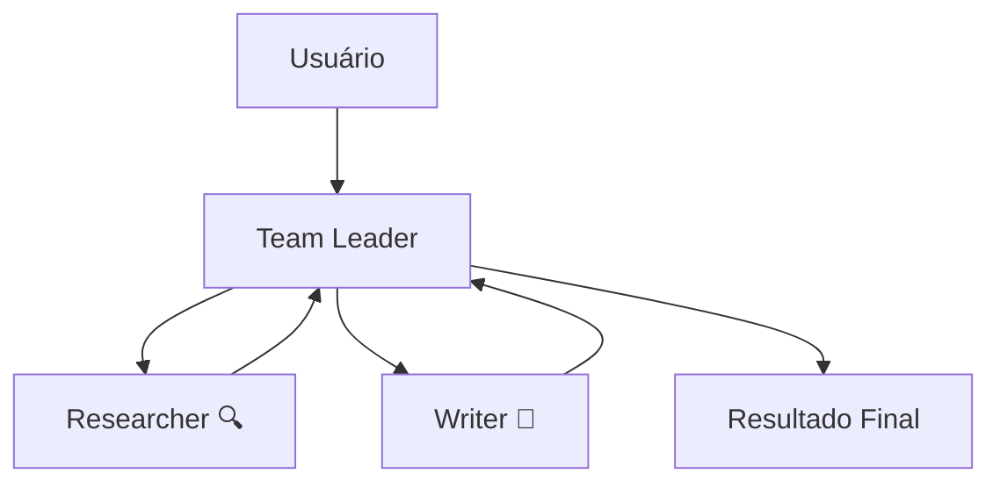

# Aula 08: Multi-Agent Team

## Objetivo

Aprender a criar equipes de agentes especializados que colaboram para resolver problemas complexos. Ao final desta aula, você terá um time com um pesquisador e um redator trabalhando juntos sob a coordenação de um líder.

## Conceitos

- `Team` — classe do Agno que orquestra múltiplos agentes
- `TeamMode` — modo de operação da equipe (coordinate, route, collaborate)
- `members` — lista de agentes que fazem parte do time
- `role` — descrição do papel de cada agente (usado pelo coordenador para delegar)
- **Delegation** — o líder do time delega subtarefas aos agentes especializados

## Pré-requisitos

- [Aula 03: Tool Calling](../aula-03-tool-calling/) completada (conceito de tools)
- `.env` com GOOGLE_API_KEY configurada

## Teoria

### Por que Múltiplos Agentes?

Um único agente generalista pode resolver muitos problemas, mas tem limitações:

- **Sobrecarga cognitiva** — instruções longas e conflitantes confundem o LLM
- **Falta de especialização** — difícil ser expert em tudo ao mesmo tempo
- **Dificuldade de manutenção** — um prompt gigante é difícil de debugar

A solução é a mesma que usamos em equipes humanas: **especialização e colaboração**.

### Arquitetura Multi-Agent

Em uma equipe de agentes, cada membro tem um papel específico:

```
┌─────────────────────────────────────────────────┐
│                  Team (equipe)                   │
│                                                  │
│  ┌──────────┐  ┌──────────┐  ┌──────────────┐  │
│  │Researcher│  │  Writer  │  │  Analyst     │  │
│  │ 🔍 Busca │  │ 📝 Texto │  │ 📊 Análise  │  │
│  └──────────┘  └──────────┘  └──────────────┘  │
│                      │                           │
│              ┌───────▼───────┐                   │
│              │  Team Leader  │                   │
│              │ (Coordenador) │                   │
│              └───────────────┘                   │
└─────────────────────────────────────────────────┘
```

O **Team Leader** (coordenador) recebe a tarefa, decide quais agentes acionar e em que ordem, e sintetiza o resultado final.

### Modos de Equipe (TeamMode)

O Agno oferece diferentes modos de coordenação:

| Modo | Descrição | Quando usar |
|------|-----------|-------------|
| `coordinate` | Líder delega tarefas e sintetiza resultados | Tarefas com etapas sequenciais (pesquisa → escrita) |
| `route` | Direciona a tarefa para o agente mais adequado | Quando apenas um especialista deve responder |
| `collaborate` | Agentes conversam entre si para chegar a um consenso | Quando múltiplas perspectivas são necessárias |

### O Padrão Coordinator

O modo `TeamMode.coordinate` segue este fluxo:

1. **Recebe** a tarefa do usuário
2. **Analisa** qual agente deve executar cada parte
3. **Delega** subtarefas aos agentes especializados
4. **Coleta** as respostas de cada agente
5. **Sintetiza** tudo em uma resposta coerente

É o padrão mais comum e versátil para equipes de agentes.

### Definindo Agentes Especializados

Cada agente do time precisa de:

- **`name`** — nome único para identificação
- **`role`** — descrição do papel (o coordenador usa isso para decidir quem acionar)
- **`tools`** — ferramentas específicas do agente (nem todos precisam das mesmas)
- **`instructions`** — comportamento específico do agente

```python
researcher = Agent(
    name="Researcher",
    role="Search the web for current information",  # O coordenador lê isso
    tools=[DuckDuckGoTools()],                       # Só ele tem busca web
    instructions="Search the web and provide factual information.",
)
```



> Diagrama completo disponível em [assets/diagram.md](assets/diagram.md).

## Prática

### Passo 1: Setup

```bash
cd aulas/aula-08-multi-agent-team
uv sync
```

### Passo 2: Código

Abra o arquivo `main.py` e analise as três seções:

**Seção 1 — Agentes especializados:**

```python
model = Gemini(id="gemini-2.5-flash")

researcher = Agent(
    name="Researcher",
    role="Search the web for current information",
    model=model,
    tools=[DuckDuckGoTools()],
    instructions="Search the web and provide factual, up-to-date information.",
)

writer = Agent(
    name="Writer",
    role="Write clear, structured content in Portuguese",
    model=model,
    instructions=[
        "Write well-structured content in Portuguese.",
        "Use markdown formatting with headers and bullet points.",
        "Be concise but informative.",
    ],
)
```

Note que cada agente tem seu próprio `role`, `tools` e `instructions`. O Researcher tem DuckDuckGoTools para buscar na web; o Writer não precisa de ferramentas, apenas redige.

**Seção 2 — Criação do Team:**

```python
team = Team(
    name="Content Team",
    model=model,
    members=[researcher, writer],
    mode=TeamMode.coordinate,          # Líder coordena as delegações
    instructions=[
        "You coordinate a research and writing team.",
        "First, delegate research to the Researcher.",
        "Then, delegate writing to the Writer based on research findings.",
        "Synthesize the final output.",
    ],
    markdown=True,
)
```

O `Team` age como um coordenador. Suas `instructions` dizem como organizar o trabalho.

**Seção 3 — Execução:**

```python
team.print_response(
    "Crie um resumo sobre as tendências de IA em 2026...",
    stream=True,
)
```

### Passo 3: Executar

```bash
uv run python main.py
```

Resultado esperado (resumido):

```
=== Team Coordenado ===

[Delegating to Researcher]
Searching for: tendências IA 2026 agentes autônomos...
Searching for: modelos multimodais 2026...

[Delegating to Writer]
Writing structured summary based on research...

┃ ## Tendências de IA em 2026
┃
┃ ### Agentes Autônomos
┃ - Evolução dos frameworks como Agno, LangChain...
┃ - Agentes capazes de planejamento multi-step...
┃
┃ ### Modelos Multimodais
┃ - Integração de texto, imagem, áudio e vídeo...
┃ - Gemini, GPT-4o liderando a tendência...
┃
┃ ### Conclusão
┃ O ano de 2026 marca a consolidação dos agentes...
```

Observe como o coordenador primeiro aciona o Researcher, depois passa os dados ao Writer.

O fluxo real é:

1. O **Team Leader** recebe "Crie um resumo sobre tendências de IA em 2026"
2. Lê os `role` dos membros e decide: Researcher primeiro (precisa de dados)
3. **Researcher** busca na web e retorna dados factuais
4. Team Leader pega os dados e delega ao **Writer**
5. **Writer** redige o conteúdo estruturado em português
6. Team Leader **sintetiza** e entrega ao usuário

## Desafio

1. **Adicione um terceiro agente**: Crie um agente "Reviewer" que revisa o conteúdo do Writer e sugere melhorias (adicione ao `members`)
2. **Experimente TeamMode.route**: Crie um time com agentes para diferentes idiomas (português, inglês, espanhol) e use `TeamMode.route` para que o coordenador direcione a tarefa ao agente do idioma correto
3. **Team com structured output**: Adicione `response_model` ao Team para que o resultado final siga um schema Pydantic

## Troubleshooting

| Erro | Solução |
|------|---------|
| `ImportError: cannot import name 'Team'` | Execute `uv sync` — verifique que `agno` está na versão mais recente |
| `ImportError: cannot import name 'TeamMode'` | `TeamMode` está em `agno.team.mode` — verifique o import |
| Agente não é acionado | Verifique se o `role` descreve claramente a função do agente |
| Resposta desorganizada | Melhore as `instructions` do Team Leader com ordem explícita |
| `TimeoutError` | Teams são mais lentos (múltiplas chamadas de API) — aumente o timeout ou simplifique |
| Um agente "fala" no idioma errado | Reforce o idioma nas `instructions` de cada agente |

## Próxima Aula

[Aula 09: Guardrails](../aula-09-guardrails/) — Aprenda a adicionar validações e proteções aos seus agentes para garantir segurança e qualidade nas respostas.
