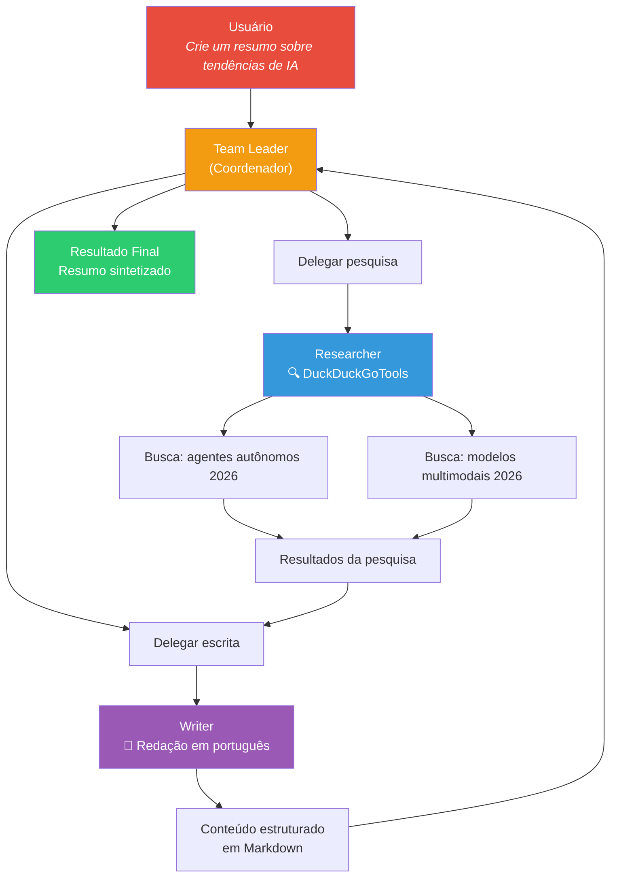
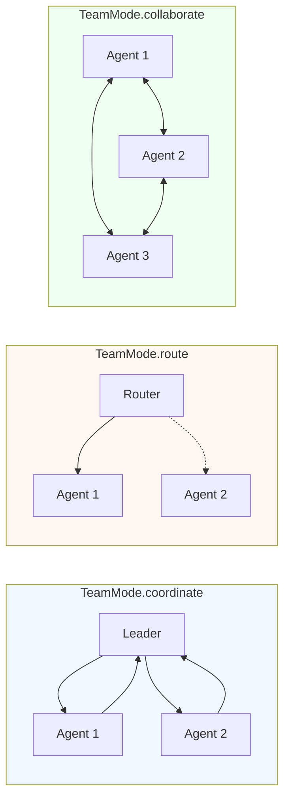
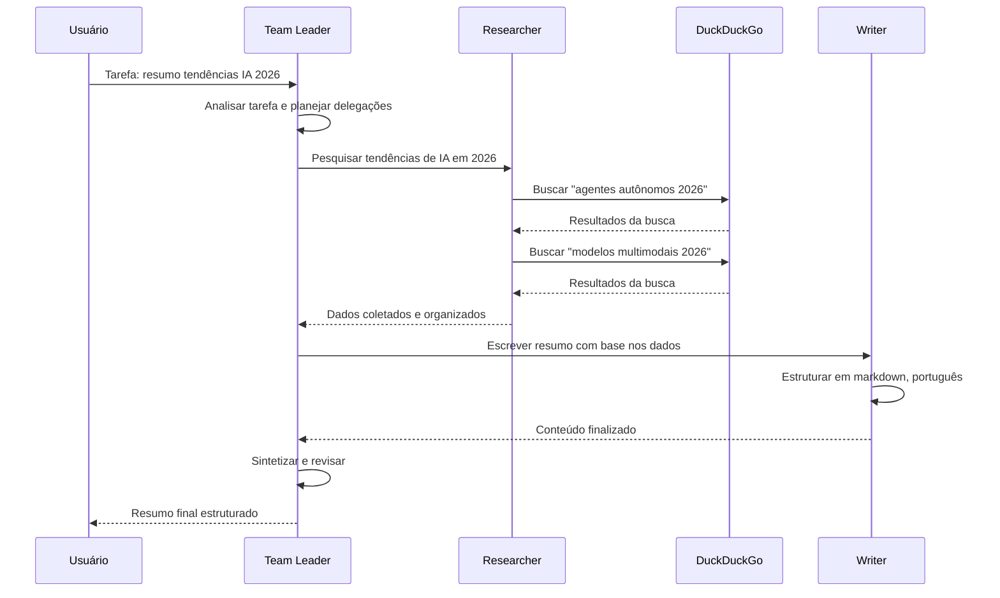

# Diagrama: Multi-Agent Team

## Coordenação de Equipe (TeamMode.coordinate)

```mermaid
flowchart TD
    U["Usuário<br/><i>Crie um resumo sobre tendências de IA</i>"] --> TL["Team Leader<br/>(Coordenador)"]

    TL --> D1["Delegar pesquisa"]
    TL --> D2["Delegar escrita"]

    D1 --> R["Researcher<br/>🔍 DuckDuckGoTools"]
    R --> R1["Busca: agentes autônomos 2026"]
    R --> R2["Busca: modelos multimodais 2026"]
    R1 --> RR["Resultados da pesquisa"]
    R2 --> RR

    RR --> D2
    D2 --> W["Writer<br/>📝 Redação em português"]
    W --> WR["Conteúdo estruturado<br/>em Markdown"]

    WR --> TL
    TL --> F["Resultado Final<br/>Resumo sintetizado"]

    style U fill:#e74c3c,color:#fff
    style TL fill:#f39c12,color:#fff
    style R fill:#3498db,color:#fff
    style W fill:#9b59b6,color:#fff
    style F fill:#2ecc71,color:#fff
```

## Comparação dos Modos de Team

```mermaid
flowchart LR
    subgraph coordinate["TeamMode.coordinate"]
        C_TL["Leader"] --> C_A1["Agent 1"]
        C_TL --> C_A2["Agent 2"]
        C_A1 --> C_TL
        C_A2 --> C_TL
    end

    subgraph route["TeamMode.route"]
        R_TL["Router"] --> R_A1["Agent 1"]
        R_TL -.-> R_A2["Agent 2"]
    end

    subgraph collaborate["TeamMode.collaborate"]
        CO_A1["Agent 1"] <--> CO_A2["Agent 2"]
        CO_A1 <--> CO_A3["Agent 3"]
        CO_A2 <--> CO_A3
    end

    style coordinate fill:#f0f8ff
    style route fill:#fff8f0
    style collaborate fill:#f0fff0
```

## Fluxo Detalhado da Comunicação

```mermaid
sequenceDiagram
    participant U as Usuário
    participant TL as Team Leader
    participant R as Researcher
    participant DDG as DuckDuckGo
    participant W as Writer

    U->>TL: Tarefa: resumo tendências IA 2026
    TL->>TL: Analisar tarefa e planejar delegações

    TL->>R: Pesquisar tendências de IA em 2026
    R->>DDG: Buscar "agentes autônomos 2026"
    DDG-->>R: Resultados da busca
    R->>DDG: Buscar "modelos multimodais 2026"
    DDG-->>R: Resultados da busca
    R-->>TL: Dados coletados e organizados

    TL->>W: Escrever resumo com base nos dados
    W->>W: Estruturar em markdown, português
    W-->>TL: Conteúdo finalizado

    TL->>TL: Sintetizar e revisar
    TL-->>U: Resumo final estruturado
```
