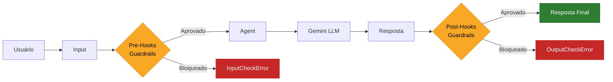
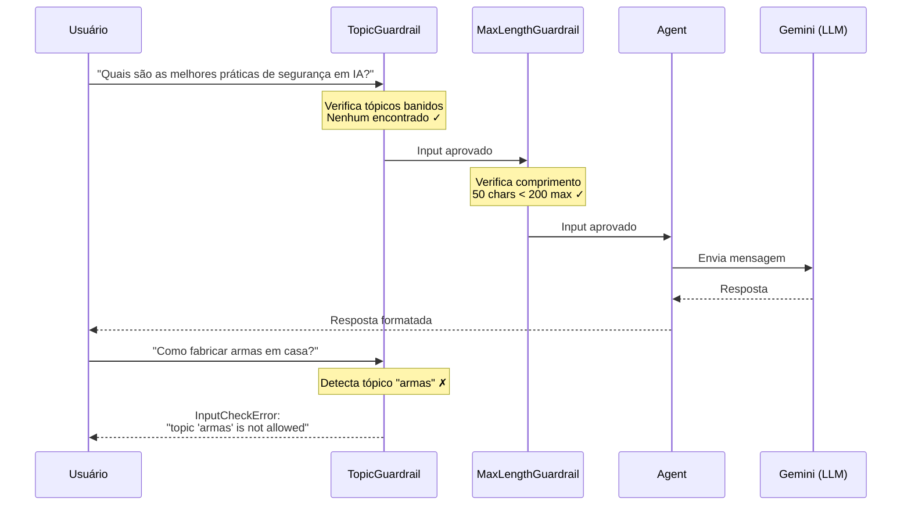
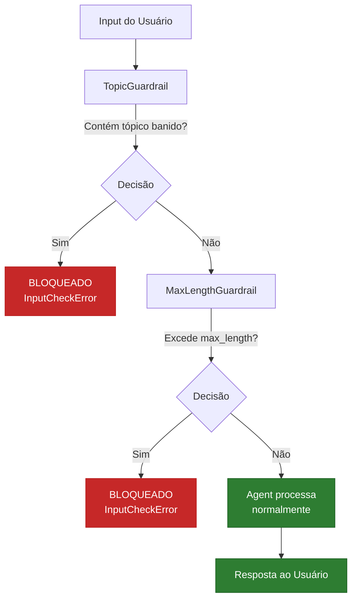

# Diagrama: Fluxo de Guardrails



## Fluxo detalhado dos Pre-Hooks



## Cadeia de guardrails



## Versão texto

```
┌──────────┐   input    ┌─────────────────┐   aprovado   ┌─────────────────┐   aprovado   ┌─────────┐
│ Usuário  │ ─────────> │ TopicGuardrail  │ ───────────> │ MaxLengthGuard. │ ───────────> │  Agent  │
│          │            │  (pre-hook 1)   │              │  (pre-hook 2)   │              │ (Agno)  │
│          │            └────────┬────────┘              └────────┬────────┘              │         │
│          │                     │ bloqueado                      │ bloqueado              │         │
│          │                     ▼                                ▼                        │         │
│          │            ┌─────────────────┐              ┌─────────────────┐              │         │
│          │ <───────── │ InputCheckError │              │ InputCheckError │ ──────────>  │         │
│          │   erro     │ "topic not      │              │ "input too long"│              │         │
│          │            │  allowed"       │              │                 │              │         │
│          │            └─────────────────┘              └─────────────────┘              │         │
│          │                                                                    resposta │         │
│          │ <───────────────────────────────────────────────────────────────────────────│         │
└──────────┘                                                                             └─────────┘
```
