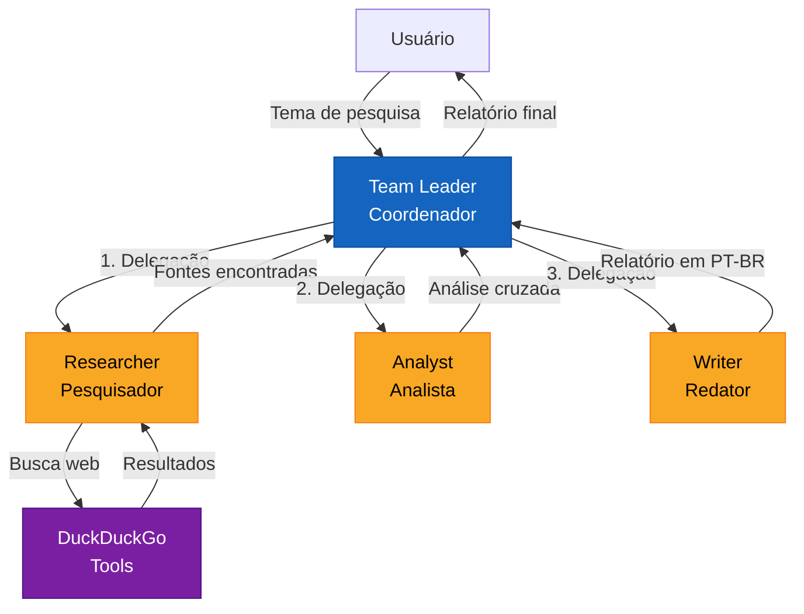
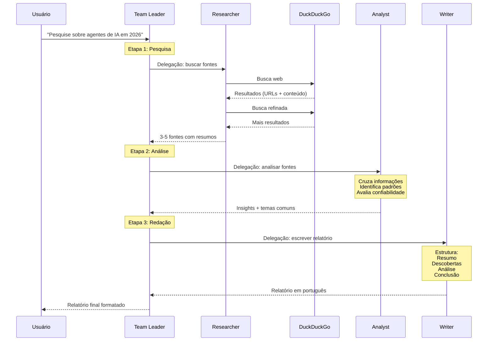
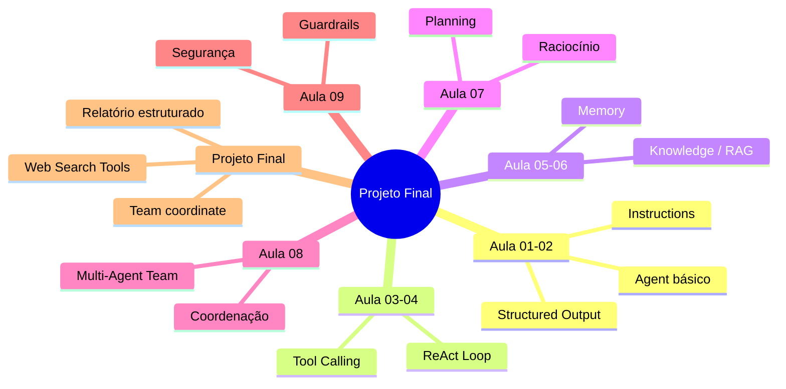

# Diagrama: Arquitetura do Assistente de Pesquisa



## Fluxo detalhado de coordenação



## Conceitos combinados das aulas anteriores



## Versão texto

```
┌──────────┐                    ┌───────────────────┐
│ Usuário  │ ─── tema ───────> │   Team Leader     │
│          │                    │   (Coordenador)   │
│          │                    └────────┬──────────┘
│          │                             │
│          │                    ┌────────▼──────────┐
│          │                    │   1. Researcher   │ ──── DuckDuckGo
│          │                    │   (Pesquisador)   │ <─── Resultados
│          │                    └────────┬──────────┘
│          │                             │ fontes
│          │                    ┌────────▼──────────┐
│          │                    │   2. Analyst      │
│          │                    │   (Analista)      │
│          │                    └────────┬──────────┘
│          │                             │ insights
│          │                    ┌────────▼──────────┐
│          │                    │   3. Writer       │
│          │                    │   (Redator)       │
│          │                    └────────┬──────────┘
│          │                             │ relatório
│          │ <── relatório final ────────┘
└──────────┘
```
